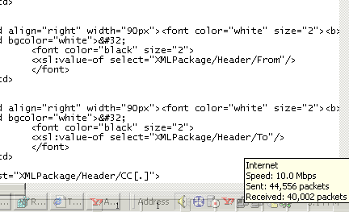



## Make your windows taskbar transparent

### Description

Are you bored from the task bar hidding the lower part of your apps? (I was).

With this simple and small program you can make your windows taskbar transparent. It can be loaded when OS starts and transparency level adjusted also. ***IMPORTANT*** New & improved version at http://www.planetsourcecode.com/xq/ASP/txtCodeId.21705/lngWId.1/qx/vb/scripts/ShowCode.htm
 
### More Info
 

             |
---                |---
**Submitted On**   |2001-03-16 15:05:00
**By**             |[Leontti A\. Ramos M\.](https://github.com/Planet-Source-Code/PSCIndex/blob/master/ByAuthor/leontti-a-ramos-m.md)
**Level**          |Intermediate
**User Rating**    |5.0 (15 globes from 3 users)
**Compatibility**  |VB 6\.0
**Category**       |[Miscellaneous](https://github.com/Planet-Source-Code/PSCIndex/blob/master/ByCategory/miscellaneous__1-1.md)
**World**          |[Visual Basic](https://github.com/Planet-Source-Code/PSCIndex/blob/master/ByWorld/visual-basic.md)
**Archive File**   |[CODE\_UPLOAD171453162001\.zip](https://github.com/Planet-Source-Code/leontti-a-ramos-m-make-your-windows-taskbar-transparent__1-21694/archive/master.zip)

